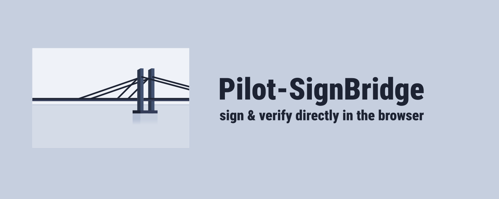

# Pilot-SignBridge

Bring secure **digital signatures** directly into your browser.  
Use your existing certificates to sign and verify files safely — no servers, no data leaks.  

## Installation

**Windows Application**  
[⬇️ Download PilotSignBridge.msi](https://github.com/pilotextensions/pilot-signbridge/releases/download/v1.0.2/PilotSignBridge.msi) The installer includes the `Windows application` and the `Browser Extension`. After installation, the app runs in the background and handles signing/verification requests using your local cryptographic provider (e.g., CryptoPro).

**Pilot-Web Extension**  
[⬇️ Download Pilot-Web Extension](https://github.com/pilotextensions/pilot-signbridge/releases/download/v1.0.0/cryptoprovider.pilot-signbridge.zip). This extension enables integration with the `Pilot-Web-Server` for seamless signing operations.

⚠️ If you need to reinstall **Pilot-SignBridge Extension** manually - [Install from Chrome Web Store](https://chromewebstore.google.com/detail/pilot-signbridge/pmdljejbakkiijaijbbgndoaignbllfp
)

## Why Pilot-SignBridge?

- Works with your existing cryptographic provider  
- Keeps private keys **on your device**  
- Easy integration with web apps  

## Check Extension Installed

- [Run Extension Check](check-extension.md)  

## Documentation

- [Global API](api/global.md)  
- [Certificate Interface](api/certificate.md)  
- [Verification Response](api/verification.md)  
- [Verification Status](api/verificationstatus.md)  

💡 *Pilot-SignBridge is currently in **beta**. We’re improving every day — your feedback is welcome!*  
